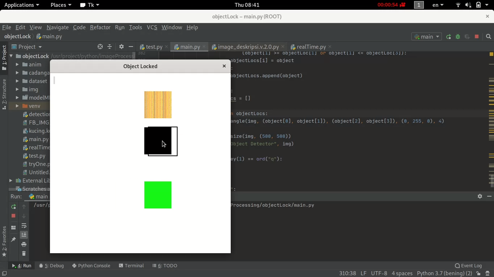

# target-lock-with-keras

**This project will make application that can lock target from image**

**Step By Step**

1. Program will get image from target that will lock
2. Program will process image for get random image with same image form taregt
3. Program will get random image for background
4. Program will training ML with image target and image background
5. Program will track target fro image

**Result**

Choice tagert



After training, program wash can track the target


**Source Code**

1. Make anim for test program

```bash
line 52 file main.py

  def makeAnim(self):
        i = 0
        while True:
            background = Image.new("RGB", (self.widthScreen + 500, self.heightScreen + 500), (255, 255, 255))
            itemOne = Image.open("anim/backgroung.png")
            itemOne = itemOne.resize((150, 150))

            itemTwo = Image.new("RGB", (150, 150), (0, 0, 0))
            itemThree = Image.new("RGB", (150, 150), (0, 255, 0))

            background.paste(itemOne, (i, 100))
            background.paste(itemTwo, (i, 300))
            background.paste(itemThree, (i, 600))

            img = background
            self.img = img
            img = img.resize((int(img.size[0] / self.rescale), int(img.size[1] / self.rescale)))
            img = ImageTk.PhotoImage(img)
            self.imgFrame.config(image=img)
            self.imgFrame.image = img
            i += 10
            if i >= 1000:
                i = 0
            time.sleep(0.2)
```

2. make function for choice target

```bash
line 84 file main.py

    def trackMouse(self, event):
        xCord = event.x
        yCord = event.y
        self.xCord = xCord
        self.yCord = yCord

        self.getObject(xCord, yCord)

    def zoomBox(self, event):
        if event.keysym == "Down":
            if self.boxSize >= 20:
                self.boxSize -= 10
        elif event.keysym == "Up":
            if (self.boxSize + 10) * 2 <= int(self.img.size[0] / self.rescale) and \
                    (self.boxSize + 10) * 2 <= int(self.img.size[1] / self.rescale):
                self.boxSize += 10
        elif event.keysym == "r":
            threading.Thread(target=self.recObject).start()

        self.getObject(self.xCord, self.yCord)
```

3. show box for choice target

```bash
line 105 file main.py

    def getObject(self, x, y):
        xCord = x
        yCord = y
        img = np.array(self.img)

        x1 = (xCord - self.boxSize) * self.rescale
        y1 = (yCord - self.boxSize) * self.rescale
        x2 = (xCord + self.boxSize) * self.rescale
        y2 = (yCord + self.boxSize) * self.rescale

        if (x1 >= 0 and y1 >= 0) and \
                (int(x2 / self.rescale) <= int(self.img.size[0] / self.rescale) and
                 int(y2 / self.rescale) <= int(self.img.size[1] / self.rescale)):
            img = cv2.rectangle(img,
                                (x1, y1),
                                (x2, y2),
                                (1, 0, 0), 4)

            img = Image.fromarray(img)
            self.boxObj = []
            self.boxObj.append(x1)
            self.boxObj.append(y1)
            self.boxObj.append(x2)
            self.boxObj.append(y2)
            img = img.resize((int(img.size[0] / self.rescale), int(img.size[1] / self.rescale)))
            img = ImageTk.PhotoImage(img)
            self.imgFrame.config(image=img)
            self.imgFrame.image = img
```

4. function for get target image

```bash
line 134 file main.py

    def recObject(self):
        self.listImgObj = []
        self.listOutputImg = []

        # get Image
        self.indexRec['text'] = "Get Image"
        x1 = self.boxObj[0]
        y1 = self.boxObj[1]
        x2 = self.boxObj[2]
        y2 = self.boxObj[3]
        oriImg = np.array(self.img)
        print("Ori Image : ", oriImg.shape)
        print("Box Object : ", y1, y2, x1, x2)

        # crop img
        boxImg = oriImg[y1: y2, x1:x2]
        boxImg = cv2.resize(boxImg, (50, 50))
        boxImg = cv2.cvtColor(boxImg, cv2.COLOR_RGB2GRAY)

        # save img
        cv2.imwrite("img/" + str(0) + ".png", boxImg)

        # decode img
        boxImg = np.reshape(boxImg, (50, 50, 1))
        boxImg = [(1. / 255)] * boxImg[np.newaxis]
        boxImg = boxImg[0]

        self.listImgObj.append(boxImg)
        self.listOutputImg.append([1, 0])

        for i in range(1, 200):
            boxImg = oriImg[y1 + random.randint(1, 50): y2 + random.randint(1, 50),
                     x1 + random.randint(1, 50):x2 + random.randint(1, 50)]
            boxImg = cv2.resize(boxImg, (50, 50))
            boxImg = cv2.cvtColor(boxImg, cv2.COLOR_RGB2GRAY)
            boxImg = np.reshape(boxImg, (50, 50, 1))

            # decode img
            boxImg = [(1. / 255)] * boxImg[np.newaxis]
            boxImg = boxImg[0]

            self.listImgObj.append(boxImg)
            self.listOutputImg.append([1, 0])

        self.indexRec['text'] = "Start Training Model"
        self.getBack()
        self.trainModel()
```
5. get random image for background

```bash
line 182 file main.py

    def getBack(self):
        oriImg = np.array(self.img)

        for i in range(200):
            x1 = random.randint(0, oriImg.shape[1] - 100)
            y1 = random.randint(0, oriImg.shape[0] - 100)
            x2 = x1 + random.randint(50, 100)
            y2 = y1 + random.randint(50, 100)
            boxImg = oriImg[y1: y2, x1: x2]
            boxImg = cv2.resize(boxImg, (50, 50))
            boxImg = cv2.cvtColor(boxImg, cv2.COLOR_RGB2GRAY)
            boxImg = np.reshape(boxImg, (50, 50, 1))

            # decode img
            boxImg = [(1. / 255)] * boxImg[np.newaxis]
            boxImg = boxImg[0]

            self.listImgObj.append(boxImg)
            self.listOutputImg.append([0, 1])
```

6. make model for training ML

```bash
line 202 file main.py

    def trainModel(self):
        self.listImgObj = np.array(self.listImgObj)
        self.listOutputImg = np.array(self.listOutputImg)

        model = Sequential()
        model.add(Conv2D(32, (3, 3), input_shape=(50, 50, 1), activation="relu"))
        model.add(MaxPooling2D(2, 2))
        model.add(Conv2D(64, (3, 3), activation="relu"))
        model.add(MaxPooling2D(2, 2))
        model.add(Conv2D(128, (3, 3), activation="relu"))
        model.add(MaxPooling2D(2, 2))
        model.add(Conv2D(128, (3, 3), activation="relu"))
        model.add(MaxPooling2D(2, 2))
        model.add(Flatten())
        model.add(Dropout(0.2))
        model.add(Dense(512, activation="relu"))
        model.add(Dense(512, activation="relu"))
        model.add(Dense(2, activation="sigmoid"))

        sgd = SGD(lr=0.05, decay=1e-5, momentum=0.9, nesterov=True)
        model.compile(
            loss="mean_squared_logarithmic_error",
            optimizer=sgd,
            metrics=['accuracy']
        )

        model.fit(
            self.listImgObj,
            self.listOutputImg,
            steps_per_epoch=10,
            epochs=10,
        )

        _, accuracy = model.evaluate(self.listImgObj, self.listOutputImg)
        self.indexRec['text'] = "Train Done, Accuracy : " + str(accuracy)

        self.detectObject(model)
```

7. function for lock target in image

```bash
line 240 file main.py

    def detectObject(self, model):
        while True:
            orig = self.img
            orig = np.array(orig)

            orig = cv2.resize(orig, (400, 400))

            img = orig
            orig = cv2.cvtColor(orig, cv2.COLOR_BGR2GRAY)
            (W, H) = orig.shape[:2]

            # make image pyramid
            pyramid = image_pyramid(orig, scale=1.5, minSize=(50, 50))

            rois = []
            locs = []

            i = 0
            for image in pyramid:
                # sliding windows
                scaleImg = W / float(image.shape[1])

                count = 0
                for (x, y, roiOrig) in sliding_window(image, 25, (50, 50)):
                    newX = int(x * scaleImg)
                    newY = int(y * scaleImg)
                    newW = int(50 * scaleImg)
                    newH = int(50 * scaleImg)
                    box = (newX, newY, newX + newW, newY + newH)

                    roi = img_to_array(roiOrig)
                    count += 1
                    rois.append(roi)
                    locs.append(box)

                    clone = orig.copy()
                    cv2.rectangle(clone, (newX, newY), (newX + newW, newY + newH),
                                  (0, 255, 0), 2)
                count = 0
                i += 1

            rois = np.array(rois)
            rois = [(1. / 255)] * rois[np.newaxis]
            rois = rois[0]
            preds = model.predict(rois)

            objectRaw = []
            found = False
            savePred = 0
            for i, pred in enumerate(preds):
                result = np.argmax(pred)
                if result == 0 and pred[0] > 0.9:
                    found = True
                    objectRaw.append(locs[i])

            objectLocs = [[0, 0, W, H]]
            for object in objectRaw:
                for i, objectLoc in enumerate(objectLocs):
                    if (object[0] >= objectLoc[0] or object[0] <= objectLoc[3]) and \
                            (object[1] >= objectLoc[1] or object[1] <= objectLoc[3]):
                        objectLocs[i] = object
                    else:
                        objectLocs.append(object)

            if not found:
                objectLocs = []

            for object in objectLocs:
                cv2.rectangle(img, (object[0], object[1]), (object[2], object[3]), (0, 255, 0), 4)

            img = cv2.resize(img, (500, 500))
            cv2.imshow("Object Detector", img)

            if cv2.waitKey(1) == ord("q"):
                break
```
